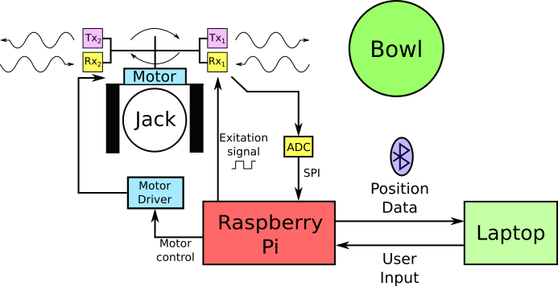

# Bowls Eye
-----------

Repository for team 18's Real Time Embedded Programming Raspberry Pi project.

## Repository Structure

[Code](https://github.com/rv456/BowlsEye/tree/master/Code) contains all of the code written for the Raspberry Pi and the external GUI.

[KiCad](https://github.com/rv456/BowlsEye/tree/master/KiCad) contains the various hardware design files used throught the project, including a full [BOM](https://github.com/rv456/BowlsEye/blob/master/KiCad/Shield/Fabrication/BOM/BOMfull.csv) and fabrication files. (note that part numbers for everything used in the project can also be found directly in the [schematics](https://github.com/rv456/BowlsEye/blob/master/KiCad/Shield) thanks to [kifields](http://kifield.readthedocs.io/en/latest/).

[Planner](https://github.com/rv456/BowlsEye/tree/master/Planner) contains documents related to project planning.  These will be removed once the project is completed.

[Resources](https://github.com/rv456/BowlsEye/tree/master/Resources) contains various datasheets, notes and other supporting files.

-----------

## Team Structure

[Harvey Leicester](https://github.com/rv456): Raspberry Pi programming and hardware design.

[Calum West](https://github.com/CalumWest): GUI programming and ultrasound guru.

# Problem
----------

Assistive technology is used throughout many sports to aid referees to determine the correct decision, or allow competitors to appeal against said decisions.  However, in the sport of lawn bowls, there is still a large factor of human error that can occur when measuring the distance between the jack and the bowls when the game is close.  As this is currently done with standard measurement techniques, any misreading of this distance by the referee will determine the wrong outcome of the game.  Therefore, this project aims to remove the possibility of human error in these measurements by designing a real time embedded system that can perform these measurments more accurately than a human.

# Solution
-----------

In order to accurately detect the distance between the jack and surrounding bowls we propose the construction of rotating distance sensor. This will consist of a pair of ultrasonic transducers mounted to a stepper motor, which will allow for 360deg of rotational distance sensing via pulse-echo detection. This will then output a real-time feed of the calculated distance to the nearest object via Bluetooth to a display running on a laptop. This GUI will also be used to start the scanning procedure and specify the system parameters.

The responsiveness of our distance sensor will be dictated by the required distance resolution, ie. a higher axial resolution will require a larger amount of data from the ultrasonic sensors to the be processed, thus slow overall responsiveness. Similarly, using a small angular step will increase the time taken to perform a full rotation. Finally, the time for a single scan to be performed in the absence of a detectable object, ie. the maximum range to be found, dictated by the wait time before moving to the next scan, will greatly impact the responsiveness of the application. All of these parameters will be user controllable via the GUI and so may be optimised for their desired time/accuracy result.

The ADC sampling rate will be between 500k-1MS/s using SPI with two channels. For a single A-scan with a maximum range of 1m there will be ~6s of data to be stored, which will be between 3 million to 6 million samples, corresponding to a detection resolution of ~500um. The Rpi will perform threshold detection to estimate the distance to an object per single scan and output this distance along with the angular position via Bluetooth for real-time display. This may require the use of three threads; one for transducer excitation and ADC sampling, one for data processing and one for data output. The GUI will be constructed using PyQT and will use QTthreads for 'listening' to the data received from the Rpi via bluetooth and to construct the final display of objects.

A system overview is shown below, and you can follow our progress via this git, or our [facebook](https://www.facebook.com/Bowls-Eye-102409543919161/) or [twitter](https://twitter.com/bowlseyepi).

